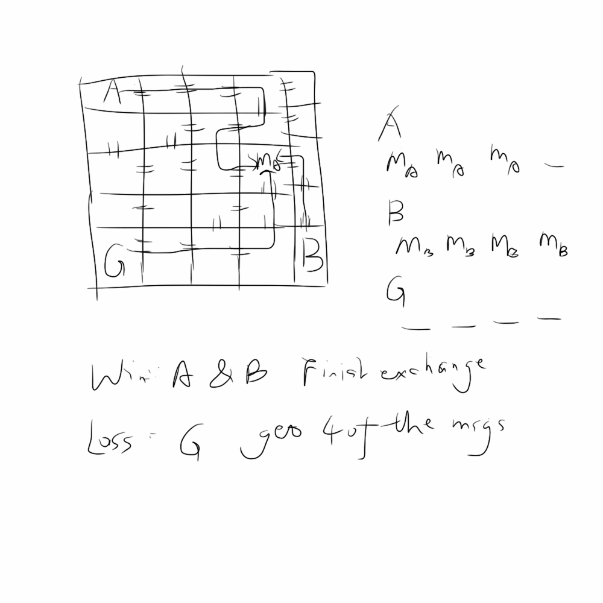
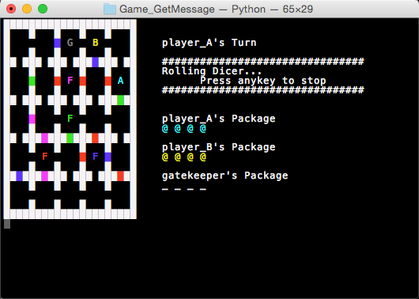
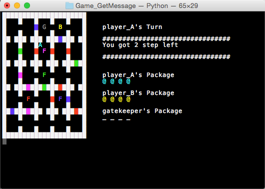

Game_GetMessage
===============

一个合作类迷宫游戏

###Day 1. 原型设计

+ 类型：合作
+ 人数：2-3
+ 设定：房间，迷宫
+ 游戏原型

+ 玩法：
	1. A 和 B 为合作玩家，在迷宫中互相交换信息(Ma,Mb)
	+ G 为守门员，截留信息 
	+ A 起始点为左上角，用骰子决定移动点数，在移动完之后可以选择捡起 B 留下的 M，或者丢下自己的 M，或者什么也不做。
	+ 格子之间的移动需要有门（=）才可以移动。
	+ A 和 B 在 G 拿到4个信息前完成交换，即 B 拥有剩余的所有 A 的信息，A 拥有所有 B 剩余的信息，即赢，反之则输
	+ 如果只有两个玩家，则需要设定 G 为 AI，或者一个移动策略，比如在有 M 的时候优先靠近最近的 M，在没有的时候，优先靠近最近的玩家。
	
###Day 2. 实现迷宫&移动

1. 生成一个5*5的地图（大小可以很方便地改），用 [Randomized Kruskal's 算法](http://en.wikipedia.org/wiki/Maze_generation_algorithm#Randomized_Kruskal.27s_algorithm) 算法生成联通所有房间的随机最少 path 图。
2. 剩下的房间之间用门联通，拥有相应钥匙则可以通过。
3. 增加锁钥机制，每个玩家只有4个包裹空间，可以放 message，也可以放钥匙。
4. 玩家已经可以在地图中移动，但还未实现捡东西和掉东西。
5. 双击 esc 或 ctrl+c 退出。

部分截图：

+ 游戏开始

+ Player_A 拿到了6点移动点数，移动了4点后状态

	
